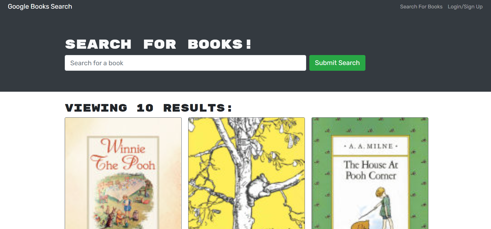

#  Book Search 

## Table of Contents

1. [Description](#Description)
2. [Installation](#Installation)
3. [Usage](#Usage)
4. [Tests](#Tests)
5. [Contributing](#Contributing)
6. [Questions](#Questions)

## Description

A refactor of a RESTful API search engine to use a GraphQL API built with an Apollo Server. The app was built using the MERN stack with a React front end, MongoDB database, and Node.js/Express.js server and API.

## Link to Website

- [BookSearch.com](https://tranquil-retreat-20053.herokuapp.com/)

## Installation

Run 'npm i' to download dependences. Then run 'npm start'.

## Usage

From the client side, users can use this application to search for books and have a saved list of favorites. This application uses the Google Books API to call books and their images, titles, authors etc.

## Contributing

Open to contributions!

## Questions

Please email me if you have further questions: 
(humkeyg@gmail.com).

Github:
[humkeyg](https://github.com/humkeyg)
